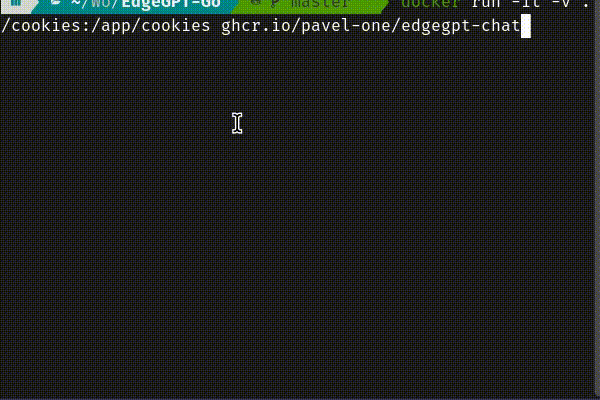

## 🪄 EdgeGPT-Go

[](https://github.com/pavel-one/EdgeGPT-Go/releases)
[](https://pkg.go.dev/github.com/pavel-one/EdgeGPT-Go)

<p align="center">
  
</p>
EdgeGPT-Go is a New Bing unofficial API developed using Golang.  
You can use it as a library, microservice or standalone cli application.  
The package supports multiple cookies. As well as rapid deployment as a microservice via docker.

## Feature:
- [x] GRPC interface
- [x] Library interface
- [x] Sync/Async request
- [x] CLI interface
- [x] Refresh session

## How to use it:

### Getting authentication (Required)
- Install and open Microsoft Edge browser
- Install [Cookie-Editor](https://chrome.google.com/webstore/detail/cookie-editor/hlkenndednhfkekhgcdicdfddnkalmdm) extension
- Go to [New Bing](https://www.bing.com/search?form=MY0291&OCID=MY0291&q=Bing+AI&showconv=1&cc=au) login and getting access
- Open the extension
- Click "Export" on the bottom right, then "Export as JSON" (This saves your cookies to clipboard)
- Create folder `cookies`
- Paste your cookies into a file `1.json`

If you have several accounts - repeat for each of them and save to the `cookies` folder

### Use as a chat cli app
```shell
docker run -it -v ./cookies:/app/cookies ghcr.io/pavel-one/edgegpt-chat
```
Or download binary in [release page](https://github.com/pavel-one/EdgeGPT-Go/releases)
### Use as a library
```shell
go get github.com/pavel-one/EdgeGPT-Go
```

```go
package main

import (
	"github.com/pavel-one/EdgeGPT-Go"
	"log"
)

func main() {
	s := EdgeGPT.NewStorage()

	gpt, err := s.GetOrSet("any-key")
	if err != nil {
		log.Fatalln(err)
	}

	// send ask async
	mw, err := gpt.AskAsync("Hi, you're alive?")
	if err != nil {
		log.Fatalln(err)
	}

	go mw.Worker() // start worker

	for range mw.Chan {
		// update answer
		log.Println(mw.Answer.GetAnswer())
		log.Println(mw.Answer.GetType())
		log.Println(mw.Answer.GetSuggestions())
		log.Println(mw.Answer.GetMaxUnit())
		log.Println(mw.Answer.GetUserUnit())
	}

	// send sync ask
	as, err := gpt.AskSync("Show an example of sockets in golang gorilla")
	if err != nil {
		log.Fatalln(err)
	}

	log.Println(as.Answer.GetAnswer())
}
```

### Use as a docker microservice
```shell
docker run -v ./cookies:/app/cookies -p 8080:8080 ghcr.io/pavel-one/edgegpt-grpc:latest
```

### Use as a docker-compose
```yaml
version: "3"
services:
  gpt:
    image: ghcr.io/pavel-one/edgegpt-grpc:latest
    restart: unless-stopped
    ports:
      - "8080:8080"
    volumes:
      - ./cookies:/app/cookies
```

## Example service
Work progress...

## FAQ:

#### Change protoc
If you change protoc file, use `protoc --go_out=. --go-grpc_out=. proto/gpt.proto`

#### Stopped after 10 redirects
If you use this library in China set environment: 
```shell
CONVERSATION_ENDPOINT=https://edge.churchless.tech/edgesvc/turing/conversation/create
``` 
Example:
```shell
docker run -e CONVERSATION_ENDPOINT=https://edge.churchless.tech/edgesvc/turing/conversation/create -v ./cookies:/app/cookies -p 8080:8080 ghcr.io/pavel-one/edgegpt-grpc:latest
```
Or docker-compose:
```yaml
version: "3"
services:
  gpt:
    image: ghcr.io/pavel-one/edgegpt-grpc:latest
    restart: unless-stopped
    environment:
      - CONVERSATION_ENDPOINT=https://edge.churchless.tech/edgesvc/turing/conversation/create
    ports:
      - "8080:8080"
    volumes:
      - ./cookies:/app/cookies
```
